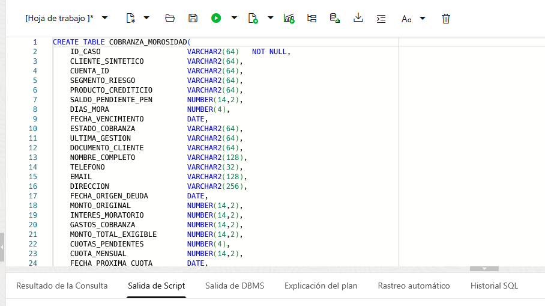
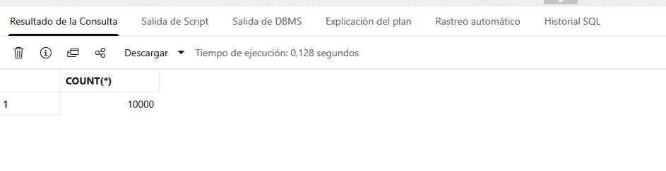
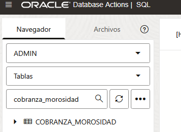
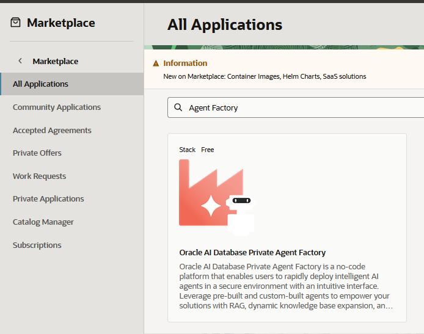
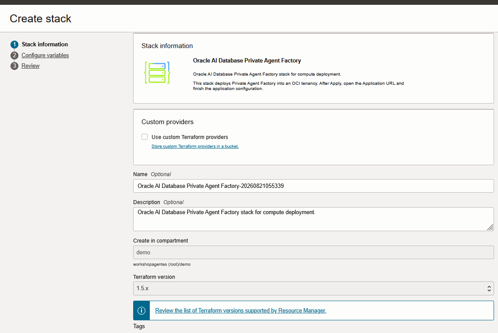
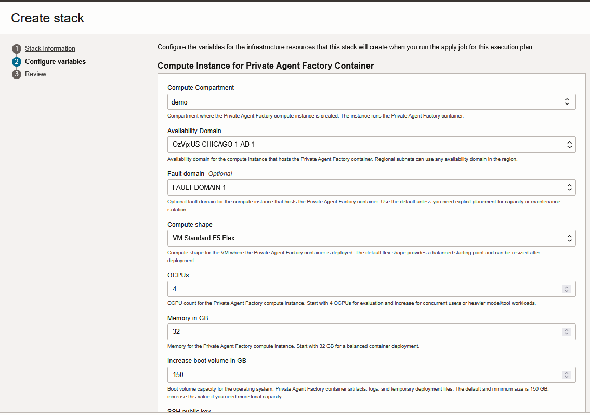
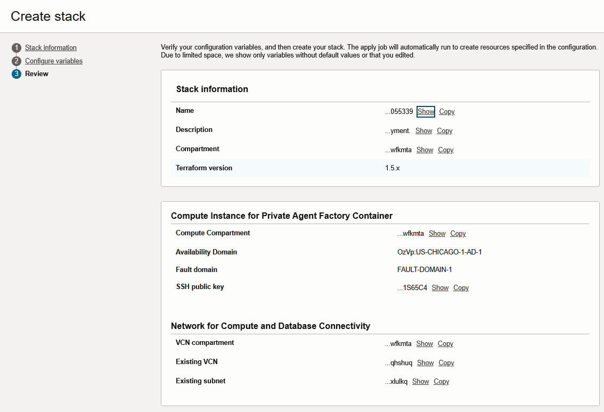
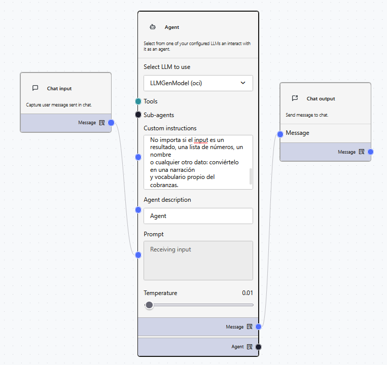
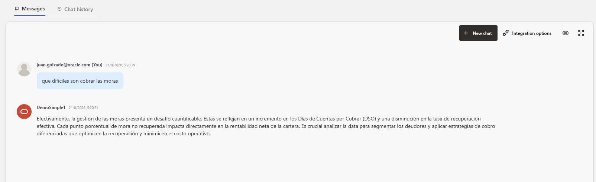
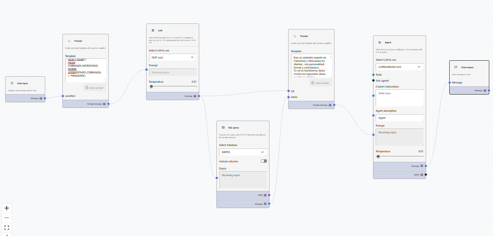

<div align="center">


# 🚀 DeepDive DPAF OCI 2026
###  AI Database Agent Factory

[](https://cloud.oracle.com/)
[](https://www.oracle.com/database/)
[](https://www.oracle.com/ai-data-platform/)


*Un workshop end‑to‑end para construir una plataforma de datos moderna e inteligente sobre Oracle Cloud Infrastructure, integrando **AI Database Private Agent Factory**.*

</div>

---

## 📖 Acerca de este workshop

En este laboratorio vas a recorrer el ciclo completo de una **AI Database Agent Factory** sobre Oracle Cloud Infrastructure. Aprovisionarás los servicios, ingestarás datos y, finalmente, construirás **agentes de IA** capaces de entender lenguaje natural, generar SQL y narrar resultados — todo sobre productos nativos de Oracle.

Trabajaremos con dos productos estrella del stack de IA de Oracle:

| Producto | Descripción |
|---|---|
| 🤖 **Oracle AI Database Private Agent Factory (DPAF)** | Factoría de agentes privados desplegada en tu tenancy, con Agent Builder visual, RAG y Text‑to‑SQL sobre Oracle Database 26ai. |

> 💡 **Pre‑requisito:** acceso activo a una consola de **Oracle Cloud Infrastructure** con permisos en el compartment donde se desplegarán los servicios.

---

## 🎯 Objetivos de aprendizaje

Al finalizar, serás capaz de:

- Aprovisionar una **Autonomous AI Database 26ai** desde OCI Console / Resource Manager.
- Ingestar datos en Autonomous mediante cpm Data Load
- Desplegar **AI Database Private Agent Factory** desde OCI Marketplace.
- Diseñar un flujo conversacional en **Agent Builder** conectado a una base de datos real 
---

<div align="center">

# 🧱 Módulo 1 · Preparación del entorno

*En este módulo preparamos el entorno base: creamos un compartment dedicado, una Autonomous AI Database 26ai y una instancia de AI Data Platform.*

</div>

---

### 1.1 Creación del compartment `demo`

Abre el menú de hamburguesa y navega a **Identity & Security → Compartments**.

En la parte izquierda selecciona el compartimento raíz de tu tenancy y haz clic en **Create Compartment**.

Completa el formulario con estos valores:

| Campo | Valor |
|---|---|
| **Name** | `demo` |
| **Description** | `Compartment para DeepDive Workshop OCI 2026` |
| **Parent Compartment** | *Root compartment de tu tenancy* |

Haz clic en **Create Compartment** y espera a que el estado aparezca como **Active**.

Luego abre el menú de acciones (**⋯**) del compartment `demo` y selecciona **Copy ocid**. Guarda este valor: lo usarás como `compartment_id` al configurar el stack.

<p align="center"></p>

- <details>
  <summary>🔽 Haz clic aquí: si tienes problemas para crear el compartment, revisa el paso a paso.</summary>

  1. Ve a **Identity & Security → Compartments**.
  2. Verifica que estás en el **Root compartment** de tu tenancy.
  3. Haz clic en **Create Compartment** y completa `Name = demo`.
  4. Si no aparece el botón o recibes error de permisos, solicita a un administrador acceso IAM para administrar compartments.

  
  </details>

---


### 1.2 Despliegue de Autonomous AI Database 

En este workshop, la **Autonomous AI Database 26ai** se despliega con el stack Terraform desde **OCI Console / Resource Manager**. No se crean manualmente desde los formularios de cada servicio.

El stack crea:

- Autonomous AI Database 26ai.
- AI Data Platform (No usado en este taller).
- Policy IAM requerida para que AIDP opere en el compartment indicado.
- Wallet de Autonomous como output `wallet_base64`.
- Archivo `.zip` de Wallet cuando `write_wallet_file = true`.

#### Región del workshop

Usa la región validada para el workshop (esto influye en el  LLM que usaremos usaremos) como referencia pondremos Chicago:

| Campo | Valor |
|---|---|
| **Region name** | `US Midwest (Chicago)` |
| **Region identifier** | `us-chicago-1` |

> Mantén en la misma región la Autonomous AI Database, Agent Factory y OCI Generative AI.

#### Crear el stack en Resource Manager

En OCI Console:

1. Ve a **Developer Services → Resource Manager → Stacks**.
2. Haz clic en **Create stack**.
3. En **Stack configuration**, selecciona:
   - **My configuration**
   - **Upload zip file**
4. Sube el archivo del stack incluido en este repositorio:
   - [`deepdive-oci-stack.zip`](./deepdive-oci-stack.zip)
5. Confirma el compartment `demo`.
6. Continúa a la configuración de variables.

<p align="center"></p>

#### Variables mínimas

Configura estas variables en el formulario del stack:

```hcl
compartment_id = "ocid1.compartment.oc1..your_compartment_ocid"
tenancy_ocid   = "ocid1.tenancy.oc1..your_tenancy_ocid"
region         = "us-chicago-1"

wallet_password = "Wallet*2026Demo"
```

<p align="center"></p>

Si el stack se crea directamente en Chicago, `region` puede quedar vacío o `null`, pero para evitar dudas en el workshop se recomienda cargar explícitamente:

```hcl
region = "us-chicago-1"
```

El stack nuevo ya trae `create_aidp = true` y `create_aidp_policy = true` como valores por defecto. Solo cambia esos toggles si necesitas omitir AIDP o si la policy ya fue creada manualmente:

```hcl
# Opcional: omitir AIDP si la tenancy o las policies todavía no están listas
create_aidp = false

# Opcional: usar una policy existente en lugar de crearla desde el stack
create_aidp_policy = false
```

La Autonomous queda fija en el código Terraform con estos parámetros:

| Parámetro | Valor |
|---|---|
| `compute_model` | `ECPU` |
| `compute_count` | `2` |
| `data_storage_size_in_gb` | `100` |
| `license_model` | `LICENSE_INCLUDED` |
| `db_workload` | `OLTP` |

#### Ejecutar Plan y Apply


1. En **Review**, valida el compartment y las variables ingresadas. Deja desmarcada la opción **Run apply** y haz clic en **Create**.

<p align="center"></p>

2. En la página del stack recién creado, haz clic en **Plan**.

<p align="center"></p>

3. Confirma que el plan inicial esperado sea:

   ```text
   Plan: 5 to add, 0 to change, 0 to destroy.
   ```

<p align="center"></p>

4. Revisa que el plan incluya:
   - Autonomous Database.
   - AI Data Platform.
   - IAM policy.
   - Wallet.
5. Ejecuta **Apply** una sola vez.

<p align="center"></p>

6. Espera a que el job termine en estado exitoso.


#### Outputs del stack

Al finalizar el **Apply**, revisa los outputs del job:

- `autonomous_database_id`
- `autonomous_database_state`
- `aidp_id`
- `aidp_state`
- `aidp_policy_id`
- `wallet_base64` (sensitive)
- `admin_password` (sensitive, default: `Workshop@123`)
- `wallet_file_path` (cuando `write_wallet_file = true`)

La contraseña de la Wallet es `wallet_password`; si no se configuró, el stack usa `admin_password`.

---

### 1.3 Descargar la Wallet de Autonomous Database

Después de que el stack de Terraform finalice correctamente, descarga la Wallet directamente desde la **Autonomous Database**.

1. Ingresa a la **OCI Console**.
2. Verifica que estés en la región indicada (Chicago u otra):

   ```text
   US Midwest (Chicago)
   ```

3. En la barra superior de búsqueda, escribe:

   ```text
   Autonomous Database
   ```

4. Abre la base de datos creada por el stack:

   ```text
   DeepDiveAutonomousDatabase
   ```

5. Verifica que el estado sea **Available** y que esté en el compartment `demo`.
6. En la página de la Autonomous Database, haz clic en **Database connection** o **DB connection**.
7. Selecciona **Download wallet**.
8. Cuando se solicite la contraseña de la Wallet, usa:

   ```text
   Wallet*2026Demo
   ```

9. Descarga el archivo `.zip` de la Wallet. El nombre será similar a:

   ```text
   Wallet_DeepDiveAutonomousDatabase.zip
   ```

Guarda el archivo `.zip` en una ubicación segura. Esta Wallet se usará en pasos posteriores del workshop para conectarse a la Autonomous Database desde herramientas o servicios que requieran conexión segura.

> No descomprimas ni modifiques el archivo de la Wallet, salvo que una instrucción posterior del workshop lo indique explícitamente.

> La Wallet también es generada por Terraform como output `wallet_base64`, pero para el workshop se recomienda descargarla desde la consola de Autonomous Database porque es el método más simple para los participantes.

---
</details>

<div align="center">

# 📥 Módulo 2 · Ingesta y catalogación de datos
</div>

---

### 2.1 Ingesta en Autonomous AI Database

Abre tu instancia activa de Autonomous.

<p align="center"></p>
<p align="center"></p>

Entra a **Database Actions → SQL** para abrir el workspace SQL.

<p align="center"></p>

#### Paso 1 · Ejecutar script integral de ingesta (una sola corrida)

Ejecuta como `ADMIN` el script:

[sqltools_oracle_schema_setup.sql](./tools/sqltools_oracle_schema_setup.sql)

Este script deja todo listo en una ejecución:

- Crea y asigna permisos.
- Crea la tabla para el ejercicio Cobranza_Morsidad

<details>
  <summary> 👇👇Ver SQL (clic para desplegar)👇👇</summary>

  ```sql
-- ================================================================
-- ================================================================
-- DeepDive Workshop OCI 2026
-- SQL Tools Script: schema ORACLELABS + ADMIN compatibility
-- Execute as ADMIN in Database Actions -> SQL
-- ================================================================
SET SERVEROUTPUT ON;

-- 0) Create ORACLELABS user (idempotent)
DECLARE
  v_exists NUMBER := 0;
BEGIN
  SELECT COUNT(*) INTO v_exists FROM dba_users WHERE username = 'ORACLELABS';

  IF v_exists = 0 THEN
    EXECUTE IMMEDIATE 'CREATE USER ORACLELABS IDENTIFIED BY "Welcome123456$"';
    EXECUTE IMMEDIATE 'ALTER USER ORACLELABS QUOTA UNLIMITED ON DATA';
  END IF;
END;
/

-- 1) Base grants
BEGIN
  EXECUTE IMMEDIATE 'GRANT CREATE SESSION TO ORACLELABS';
  EXECUTE IMMEDIATE 'GRANT CREATE TABLE TO ORACLELABS';
  EXECUTE IMMEDIATE 'GRANT CREATE VIEW TO ORACLELABS';
  EXECUTE IMMEDIATE 'GRANT CREATE SEQUENCE TO ORACLELABS';
EXCEPTION
  WHEN OTHERS THEN
    IF SQLCODE != -1927 THEN
      RAISE;
    END IF;
END;
/


BEGIN
  EXECUTE IMMEDIATE 'GRANT EXECUTE ON DBMS_CLOUD TO ORACLELABS';
EXCEPTION
  WHEN OTHERS THEN
    NULL;
END;
/

-- 3) Create table in ORACLELABS
BEGIN
  EXECUTE IMMEDIATE q'[
    CREATE TABLE ORACLELABS.COBRANZA_MOROSIDAD (
      key_id NUMBER,
      tournament_id VARCHAR2(50),
      tournament_name VARCHAR2(200),
      match_id VARCHAR2(100),
      match_name VARCHAR2(200),
      stage_name VARCHAR2(100),
      group_name VARCHAR2(100),
      group_stage NUMBER,
      knockout_stage NUMBER,
      replayed NUMBER,
      replay NUMBER,
      match_date VARCHAR2(50),
      match_time VARCHAR2(50),
      stadium_id VARCHAR2(50),
      stadium_name VARCHAR2(200),
      city_name VARCHAR2(100),
      country_name VARCHAR2(100),
      home_team_id VARCHAR2(50),
      home_team_name VARCHAR2(100),
      home_team_code VARCHAR2(10),
      away_team_id VARCHAR2(50),
      away_team_name VARCHAR2(100),
      away_team_code VARCHAR2(10),
      score VARCHAR2(20),
      home_team_score NUMBER,
      away_team_score NUMBER,
      home_team_score_margin NUMBER,
      away_team_score_margin NUMBER,
      extra_time NUMBER,
      penalty_shootout NUMBER,
      score_penalties VARCHAR2(20),
      home_team_score_penalties NUMBER,
      away_team_score_penalties NUMBER,
      result VARCHAR2(50),
      home_team_win NUMBER,
      away_team_win NUMBER,
      draw NUMBER
    )
  ]';
EXCEPTION
  WHEN OTHERS THEN
    IF SQLCODE != -955 THEN
      RAISE;
    END IF;
END;
/

-- 4) Load CSV into ORACLELABS
BEGIN
  EXECUTE IMMEDIATE 'ALTER SESSION SET CURRENT_SCHEMA = ORACLELABS';
  EXECUTE IMMEDIATE 'TRUNCATE TABLE COBRANZA_MOROSIDAD';

  EXECUTE IMMEDIATE 'ALTER SESSION SET CURRENT_SCHEMA = ADMIN';
EXCEPTION
  WHEN OTHERS THEN
    EXECUTE IMMEDIATE 'ALTER SESSION SET CURRENT_SCHEMA = ADMIN';
    RAISE;
END;
/
COMMIT;

-- 5) Refresh ADMIN table from ORACLELABS
BEGIN
  EXECUTE IMMEDIATE 'DROP TABLE ADMIN.COBRANZA_MOROSIDAD PURGE';
EXCEPTION
  WHEN OTHERS THEN
    IF SQLCODE != -942 THEN
      RAISE;
    END IF;
END;
/

CREATE TABLE ADMIN.COBRANZA_MOROSIDAD AS
SELECT *
FROM ORACLELABS.COBRANZA_MOROSIDAD;

COMMIT;

-- 6) Enable ORDS REST for ORACLELABS
BEGIN
  ORDS.ENABLE_SCHEMA(
    p_enabled             => TRUE,
    p_schema              => 'ORACLELABS',
    p_url_mapping_type    => 'BASE_PATH',
    p_url_mapping_pattern => 'oraclelabs',
    p_auto_rest_auth      => FALSE
  );
EXCEPTION
  WHEN OTHERS THEN
    NULL;
END;
/

BEGIN
  ORDS.ENABLE_OBJECT(
    p_enabled        => TRUE,
    p_schema         => 'ORACLELABS',
    p_object         => 'COBRANZA_MOROSIDAD',
    p_object_type    => 'TABLE',
    p_object_alias   => 'COBRANZA_MOROSIDAD',
    p_auto_rest_auth => FALSE
  );
EXCEPTION
  WHEN OTHERS THEN
    NULL;
END;
/
COMMIT;

-- 7) Quick validations
SELECT username, account_status
FROM dba_users
WHERE username = 'ORACLELABS';

SELECT COUNT(*) AS total_oraclelabs
FROM ORACLELABS.COBRANZA_MOROSIDAD;

SELECT COUNT(*) AS total_admin
FROM ADMIN.COBRANZA_MOROSIDAD;

-- 8) Print REST URLs
DECLARE
  l_db_name VARCHAR2(128);
BEGIN
  SELECT LOWER(name) INTO l_db_name FROM v$database;

  DBMS_OUTPUT.PUT_LINE('--- ORDS REST ---');
  DBMS_OUTPUT.PUT_LINE('Base schema URL (estimated):');
  DBMS_OUTPUT.PUT_LINE('https://' || l_db_name || '.adb.us-chicago-1.oraclecloudapps.com/ords/oraclelabs/');
  DBMS_OUTPUT.PUT_LINE('Table resource URL:');
  DBMS_OUTPUT.PUT_LINE('https://' || l_db_name || '.adb.us-chicago-1.oraclecloudapps.com/ords/oraclelabs/COBRANZA_MOROSIDAD/');
  DBMS_OUTPUT.PUT_LINE('If URL does not respond, take Database Actions host and append /ords/oraclelabs/');
END;
/

-- AIDP schema hint
-- Preferred schema in external catalog: ORACLELABS


  ```
  </details>

Antes de ejecutar, selecciona primero el código y luego usa el botón verde **Run Statement** o el botón **Run Script**.

<p align="center"></p>

#### Paso 2 · Ingesta de datos 

Via autonomous database cargar el archivo cobranza_morosidad.csv
[Descargar datos `](./tools/cobranza_morosidad.csv)

Validar que se carguen completamente el archivo

```sql
select count(*) from COBRANZA_MOROSIDAD;
```

<p align="center"></p>

También puedes inspeccionar la tabla desde el panel lateral → clic derecho → **Open**.

<p align="center"></p>

---


<div align="center">


# 🤖 Módulo 3 · AI Database Private Agent Factory

[](https://docs.oracle.com/en/database/oracle/agent-factory/index.html)

*Configuramos la factoría privada de agentes ya desplegada sobre Oracle Database 26ai, la integramos con nuestra Autonomous y construimos agentes Text‑to‑SQL y flujos conversacionales.*

</div>

---

### 3.1 Creacion de Redes y Permisos

Ir a Networking → Virtual Cloud Networks y confirmar el compartment.

Crear una VCN con acceso a Internet:
- Name: vcn-agent
- Dejar lo demás por defecto y seleccionar Next → Create.

En la VCN, abrir:
Security → Security Lists → Default Security List → Security Rules

Agregar reglas de entrada:
  
    Source CIDR	Puerto	Finalidad
    0.0.0.0/0	8080	Interfaz web de DPAF
    0.0.0.0/0	1521	Conexión con Oracle Database

Guardar con Add Ingress Rules.

### 3.2 Despliegue en OCI Marketplace

Ir a Marketplace → All Applications.

Buscar **Oracle AI Database Private Agent Factory.** y seleccionalo



Seleccionarla y pulsar **Launch Stack**; confirmar los siguientes datos.

En Stack information, dejar o ajustar nombre y descripción, Click Next.



En Configure variables:

    Sección	                    Valor
    Region	                    Tu región OCI actual
    VM compartment	            Tu compartment
    Subnet compartment	        Tu compartment
    VCN	                        vcn-agent
    Existing subnet	            Una subred pública
    Public or Private 	        public
    Agent Factory server        display name	AgentFactoryVM
    Agent Factory server shape	VM.Standard.E5.Flex





Cargar una llave pública SSH.  
[Descargar la llave pública SSH `oraclelabs.pub`](./tools/oraclelabs.pub)

En Review, lanzar el stack. El texto señalaba que tardaba unos 3–4 minutos y que el log final entrega la URL de DPAF.





### 3.3 Registro inicial y configuración de modelos

Abre el link entregado por el stack. Verás la página de **registro inicial**:

<p align="center"></p>

Registra tu cuenta y continúa a la **conexión con la base de datos**, cargando la Wallet generada por Resource Manager en el paso **1.2**.

<p align="center"></p>

| Campo | Valor |
|---|---|
| **Air‑gapped environment** | `No` |
| **Does the database server use a wallet?** | `Yes` |
| **Are the OCI certificates added to the wallet?** | `Yes` |

Prueba la conexión; un mensaje de éxito confirma la comunicación con la base.

<p align="center"></p>

Al presionar **Next** verás los logs de instalación. En el paso siguiente configuraremos los modelos.

<details>
<summary><b>🔐 Anexo · Creación de API Keys y credenciales OCI</b></summary>

<br>

Este anexo explica cómo **crear y descargar un API Key** en Oracle Cloud, y cómo obtener las variables necesarias para establecer conexión con los servicios de OCI desde aplicaciones externas (SDK, Python, scripts, DPAF, etc.).

> ⚠️ **Importante:** no basta con descargar la llave. En la pantalla de configuración debes **copiar el bloque al archivo `~/.oci/config`** y presionar el botón **Add**. Si no presionas **Add**, la llave descargada queda **no válida** o no asociada correctamente al usuario.

#### 📋 Requisitos

- Acceso activo a tu cuenta de **Oracle Cloud Infrastructure**.
- Permisos en tu usuario para administrar **Tokens and Keys**.

---

#### 1 · Acceder al perfil del usuario

En la consola de OCI, arriba a la derecha, haz clic en el **icono de usuario** y selecciona tu cuenta.

<p align="center"></p>

---

#### 2 · Abrir "Tokens and Keys"

Dentro del panel de tu usuario, entra a la pestaña **Tokens and Keys**.

<p align="center"></p>

---

#### 3 · Crear y descargar el API Key

Ubica la sección **API Keys** → clic en **Add API Key**.

<p align="center"></p>

Selecciona **Generate API Key Pair** y luego **Download private key**.

<p align="center"></p>

> ✅ **Resultado esperado:** tendrás un archivo `.pem` descargado (normalmente `oci_api_key.pem`).

---

#### 4 · Copiar la configuración y presionar **Add** (paso crítico)

Al terminar la descarga, OCI muestra un bloque de **configuración sugerida** con los campos necesarios. Cópialo a tu archivo `~/.oci/config`:

```ini
[DEFAULT]
user=ocid1.user.oc1..aaaaaaaa...
fingerprint=12:34:56:78:90:ab:cd:ef:...
tenancy=ocid1.tenancy.oc1..aaaaaaaa...
region=<tu-region>
key_file=/RUTA/A/.oci/oci_api_key.pem
```

Luego presiona **Add** en la consola. Si no lo haces, la llave queda huérfana.

---

#### 5 · Obtener el Compartment ID

Algunas integraciones (incluido DPAF) requieren el **OCID del compartment** donde corren los servicios.

| Paso | Acción |
|---|---|
| 1 | Menú lateral → **Identity & Security → Compartments** |
| 2 | Busca y selecciona el compartment (por ejemplo `ora26ai`) |
| 3 | Copia el valor de **OCID** desde los detalles |

---
Para nuestro caso, al ser cuentas Trial, el compartment ID (__OCID del compartment__) es el mismo del Tenant (__OCID del Tenant__) ya que estamos trabajando sobre el root. 

#### 6 · Variables finales que necesitarás

Al terminar este proceso deberías tener a mano:

| Variable | Dónde se obtiene |
|---|---|
| `user` | OCID de tu usuario · Identity → My profile |
| `fingerprint` | Se muestra al crear el API Key |
| `tenancy` | OCID de tenancy · Administration → Tenancy details |
| `region` | Región donde estás ejecutando el workshop (por ejemplo `us-chicago-1`, `sa-saopaulo-1`, `uk-london-1` o `eu-frankfurt-1`) |
| `key_file` | Ruta local al `.pem` descargado |
| `compartment_id` | OCID del compartment (paso 5) |

Con estas seis variables puedes autenticar llamadas al SDK de OCI, configurar modelos en DPAF, o conectar desde scripts Python.

</details>

#### Configuración del modelo de lenguaje (LLM)

<p align="center"></p>

Esta configuración **depende de la región**. Antes de completar el formulario, identifica primero el código de región de tu tenancy y usa ese mismo valor en el endpoint del servicio.

El endpoint base sigue este patrón:

```text
https://inference.generativeai.<tu-region>.oci.oraclecloud.com
```

Para que el laboratorio sea reproducible sin importar si estás en Chicago, São Paulo, London o Frankfurt, recomendamos usar una combinación de modelos que se mantiene disponible en esas cuatro regiones:

| Región OCI | Código de región | Endpoint | LLM recomendado para este workshop | Embeddings recomendados |
|---|---|---|---|---|
| Chicago | `us-chicago-1` | `https://inference.generativeai.us-chicago-1.oci.oraclecloud.com` | `cohere.command-r-08-2024` | `cohere.embed-multilingual-v3.0` |
| São Paulo | `sa-saopaulo-1` | `https://inference.generativeai.sa-saopaulo-1.oci.oraclecloud.com` | `cohere.command-r-08-2024` | `cohere.embed-multilingual-v3.0` |
| London | `uk-london-1` | `https://inference.generativeai.uk-london-1.oci.oraclecloud.com` | `cohere.command-r-08-2024` | `cohere.embed-multilingual-v3.0` |
| Frankfurt | `eu-frankfurt-1` | `https://inference.generativeai.eu-frankfurt-1.oci.oraclecloud.com` | `cohere.command-r-08-2024` | `cohere.embed-multilingual-v3.0` |

```yaml
Model id:       cohere.command-r-08-2024
Endpoint:       https://inference.generativeai.<tu-region>.oci.oraclecloud.com
Compartment ID: ocid1.compartment...     # Identity and Security → Compartments
User ID:        ocid1.user.oc1...        # Identity → My profile
```

> 🔎 Puedes usar cualquier modelo disponible en el [OCI Generative AI Playground — Chat](https://cloud.oracle.com/ai-service/generative-ai/playground/chat) de la consola o en la documentación oficial [Generative AI Models by Region](https://docs.oracle.com/en-us/iaas/Content/generative-ai/model-endpoint-regions.htm). Si tu región ofrece otros modelos y prefieres usarlos, recuerda cambiar **ambas cosas**: el `Model id` y el `Endpoint`.

<p align="center"></p>

#### Configuración del modelo de Embeddings

Al hacer scroll encontrarás la opción para agregar un modelo de embeddings.

<p align="center"></p>

Selecciona **OCI Gen AI** y completa:

```yaml
Model id:       cohere.embed-multilingual-v3.0
Endpoint:       https://inference.generativeai.<tu-region>.oci.oraclecloud.com
Compartment ID: ocid1.compartment...
User ID:        ocid1.user.oc1...
```

> 💡 Para este workshop recomendamos `cohere.embed-multilingual-v3.0` porque evita fricciones entre regiones. Si en tu región también tienes disponible `cohere.embed-multilingual-image-v3.0` y deseas usar capacidades multimodales, puedes reemplazarlo, pero verifica primero que esté habilitado en tu tenancy y en esa región específica.

> 🔎 Lista de modelos disponibles: [OCI Generative AI Playground — Embed](https://cloud.oracle.com/ai-service/generative-ai/playground/embed) de la consola o en la documentación oficial [Generative AI Models by Region](https://docs.oracle.com/en-us/iaas/Content/generative-ai/model-endpoint-regions.htm).

Si las conexiones son exitosas, continúa con la instalación.

<p align="center"></p>
<p align="center"></p>

#### Reinicio obligatorio de la VM de Agent Factory (Workshop)

En este workshop, este paso es obligatorio.

Después de completar exitosamente la instalación del stack y la configuración inicial, reinicia la VM de Agent Factory antes de continuar con el uso de la plataforma.

Motivo operativo en taller:
- Reduce errores intermitentes de sesión/login.
- Evita problemas donde componentes UI no reflejan cambios (por ejemplo, Data Source o catálogos que no aparecen de inmediato).
- Estabiliza el arranque de servicios para los laboratorios siguientes.

Procedimiento:
1. Ve a **OCI Console** -> **Compute** -> **Instances**.
2. Selecciona la instancia desplegada por el stack (por ejemplo `AgentFactoryVM`).
3. Haz clic en **Reboot** (reinicio normal, no reinicio forzado).
4. Espera a que la instancia vuelva a estado **Running**.

Validación después del reinicio:
1. Verifica que puedas ingresar de nuevo a:
- `https://<IP_PUBLICA>:8080/agentFactory/#/login`
2. Verifica que la plataforma cargue correctamente el home.
3. Continúa con la navegación de la plataforma y los laboratorios.
---

### 3.4 Navegación por la plataforma

Al finalizar, accederás a la **home de DPAF**:

<p align="center"></p>

Ya puedes construir tus propios flujos y agentes de IA.

---


####  Crear el Data Source

En el panel izquierdo selecciona **Data Source** y crea uno de tipo **Database**:

| Campo | Valor |
|---|---|
| **Name** | *Nombre descriptivo de la conexión* |
| **Description** | *Propósito de la fuente* |
| **Connection type** | *Carga la Wallet generada por Resource Manager en 1.2* |
| **Username** | `ADMIN` |
| **Password** | *la contraseña de tu Autonomous* |

<p align="center"></p>

Haz clic en **Test Connection** y luego **Add Database Source**.

> ✅ Al volver al panel **Data Source** verás tu nueva fuente listada.


**Selección de la base de datos** — elige la fuente configurada.

Confirma con **Add New Source**.

<p align="center"></p>


---

### 3.5 Lab · Agent Builder — Especialista en Cobranzas y Morosidad

Construirás un flujo visual en **Agent Builder** en dos etapas:

1. **Parte 1** — agente espacialista  simple (4 bloques).
2. **Parte 2** — flujo completo con Text‑to‑SQL sobre la base de datos real.

---

#### ⚽ Parte 1 · Agente especialista simple

Flujo mínimo y funcional con cuatro bloques: `Chat input` → `Prompt` → `Agent` → `Chat output`.

<p align="center"></p>

##### 1.1 · Crear un nuevo flujo

Menú izquierdo → **Agent Builder** → **New Flow**.

<p align="center"></p>

##### 1.2 · Bloque `Chat input`

Sección **INPUTS** → arrastra **Chat input** al lienzo. Expone la variable `Message`.

##### 1.3 · Bloque `Prompt`

Sección **INPUTS** → arrastra **Prompt**. Configura el campo **Template**:

```text
Eres un especialista en cobranzas de clientes, tienes una personalidad formal y pegada los numeros.
Tu misión es transformar cualquier información o dato que recibas en unadatos reales que permitan entender el estatus actual de las cobranzas y morosidad

No importa si el input es un resultado, una lista de números, un nombre
o cualquier otro dato: conviértelo en una narración 
y vocabulario propio del cobranzas.
```

> 💡 Sin variables `{{}}`. La salida **Prompt message** se conectará al campo **Custom instructions** del `Agent`.

##### 1.4 · Bloque `Agent`

Sección **AGENTS** → arrastra **Agent** y configura:

| Campo | Valor |
|---|---|
| **Select LLM to use** | El mismo LLM conversacional que configuraste antes. Recomendado: `cohere.command-r-08-2024 (oci)` si aparece disponible en tu región, sino no hay problema buscaremos alguna disponible |
| **Temperature** | `0.01` |
| **Agent description** | `Agent` |

Conexiones:

- `Prompt.Prompt message` → `Agent.Custom instructions`
- `Chat input.Message` → `Agent.Prompt`

> 💡 La personalidad entra como **instrucción de sistema**, mientras que el mensaje del usuario va al campo **Prompt** del agente.

##### 1.5 · Bloque `Chat output`

Sección **OUTPUTS** → arrastra **Chat output** y conecta `Agent.Message` → `Chat output.Message`.

##### 1.6 · Guardar y probar

**Save** → **Playground**. Prueba con, por ejemplo:

> `que dificiles son cobrar las moras`

<p align="center"></p>

#### ⚽ Parte 2 · Flujo completo con Text‑to‑SQL

Extenderemos el flujo para que reciba preguntas, genere SQL, lo ejecute contra la base de datos real y responda como narración.

<p align="center"></p>

##### 2.1 · Crear el Data Source (si no ejecutaste el Lab anterior)

Para esta parte necesitas una conexión de tipo **Database** disponible en DPAF. Si ya la creaste en el Lab anteriormente, puedes reutilizarla y continuar al paso siguiente.

En el panel izquierdo selecciona **Data Source** y crea uno de tipo **Database**:

| Campo | Valor |
|---|---|
| **Name** | *Nombre descriptivo de la conexión* |
| **Description** | *Propósito de la fuente* |
| **Connection type** | *Carga la Wallet generada por Resource Manager en 1.2* |
| **Username** | `ADMIN` |
| **Password** | *la contraseña de tu Autonomous* |

<p align="center"></p>

Haz clic en **Test Connection** y luego **Add Database Source**.

> ✅ Al volver al panel **Data Source** verás tu nueva fuente listada.

##### 2.2 · Continuar editando el flujo

Seguimos trabajando sobre el flujo de la Parte 1.

##### 2.3 · Primer `Prompt` — generador de SQL

Añade un bloque **Prompt** con este **Template**:

```text
Eres un agente que genera consultas SQL para responder a la siguiente 
AGENTE RIESGO MORAS

Eres un agente que genera consultas SQL para responder a la siguiente pregunta:

{{question}}

Tienes una tabla de datos de partidos de Cobranza  y Morosidad con la siguiente estructura.

CREATE TABLE COBRANZA_MOROSIDAD(
    ID_CASO                    VARCHAR2(64)   NOT NULL,
    CLIENTE_SINTETICO          VARCHAR2(64),
    CUENTA_ID                  VARCHAR2(64),
    SEGMENTO_RIESGO            VARCHAR2(64),
    PRODUCTO_CREDITICIO        VARCHAR2(64),
    SALDO_PENDIENTE_PEN        NUMBER(14,2),
    DIAS_MORA                  NUMBER(4),
    FECHA_VENCIMIENTO          DATE,
    ESTADO_COBRANZA            VARCHAR2(64),
    ULTIMA_GESTION             VARCHAR2(64),
    DOCUMENTO_CLIENTE          VARCHAR2(64),
    NOMBRE_COMPLETO            VARCHAR2(128),
    TELEFONO                   VARCHAR2(32),
    EMAIL                      VARCHAR2(128),
    DIRECCION                  VARCHAR2(256),
    FECHA_ORIGEN_DEUDA         DATE,
    MONTO_ORIGINAL             NUMBER(14,2),
    INTERES_MORATORIO          NUMBER(14,2),
    GASTOS_COBRANZA            NUMBER(14,2),
    MONTO_TOTAL_EXIGIBLE       NUMBER(14,2),
    CUOTAS_PENDIENTES          NUMBER(4),
    CUOTA_MENSUAL              NUMBER(14,2),
    FECHA_PROXIMA_CUOTA        DATE,
    FECHA_ULTIMO_PAGO          DATE,
    MONTO_ULTIMO_PAGO          NUMBER(14,2),
    MONTO_PAGADO_ACUMULADO     NUMBER(14,2),
   CANAL_PREFERIDO_CONTACTO   VARCHAR2(64),
    NUMERO_INTENTOS_CONTACTO   NUMBER(3),
    FECHA_ULTIMO_CONTACTO      DATE,
    RESULTADO_ULTIMO_CONTACTO  VARCHAR2(128),
    PROMESA_PAGO_FECHA         DATE,
    PROMESA_PAGO_MONTO         NUMBER(14,2),
    PROMESA_PAGO_CUMPLIDA      VARCHAR2(16),
    GESTOR_COBRANZA            VARCHAR2(64),
    AGENCIA_O_CARTERA          VARCHAR2(64),
    PRIORIDAD_GESTION          VARCHAR2(32),
    ETAPA_COBRANZA             VARCHAR2(32),
    ACUERDO_REFINANCIACION     VARCHAR2(16),
    FECHA_REFINANCIACION       DATE,
    SALDO_REFINANCIADO         NUMBER(14,2),
    RIESGO_INCUMPLIMIENTO      NUMBER(4,2),
    SCORE_COBRANZA             NUMBER(4),
    FECHA_ACTUALIZACION        DATE,
    USUARIO_ACTUALIZACION      VARCHAR2(64),
    DEPARTAMENTO               VARCHAR2(64),
    PROVINCIA                  VARCHAR2(64),
    DISTRITO                   VARCHAR2(64),
  CONSTRAINT PK_COBRANZA_MOROSIDAD
        PRIMARY KEY (ID_CASO)
);

Debes generar únicamente código SQL, sin comentarios (ni `--` ni `/** */`).
Cualquier texto adicional constituye un error grave. No finalices el SQL con `;`.

Usa solo las columnas listadas en la estructura de la tabla.

Ejemplo:
Pregunta: ¿Cuántos estados de cobranza tiene PENDIENTE?
Respuesta esperada:
SELECT count(*)
FROM COBRANZA_MOROSIDAD
WHERE UPPER(ESTADO_COBRANZA) = 'PENDIENTE';
```

Conecta `Chat input.Message` → `Prompt.question`.

##### 2.4 · Bloque `LLM`

Sección **LANGUAGE MODEL** → añade **LLM**.

| Campo | Valor |
|---|---|
| **Select LLM to use** | El mismo LLM conversacional que configuraste antes. Recomendado: `cohere.command-r-08-2024 (oci)` si aparece disponible en tu región |
| **Temperature** | `0.01` |

Conecta `Prompt(SQL generator).Prompt message` → `LLM.Prompt`.

> 💡 Una temperatura muy baja fuerza respuestas deterministas — ideal para SQL.

##### 2.5 · Bloque `SQL query`

Sección **DATA** → añade **SQL query**.

| Campo | Valor |
|---|---|
| **Select database** | El `Data Source` creado en el anterior |
| **Include columns** | ✅ |
| **Query** | *conectado desde `LLM.Message`* |

<p align="center"></p>

##### 2.6 · Segundo `Prompt` — narrador con datos reales

Añade un segundo bloque **Prompt** que combine pregunta + SQL + datos:

```text
Eres un asistente experto en Cobranzas y Morosidad de clientes , con personalidad formal y controladora.
Tu rol es transformar datos crudos en respuestas claras, narrativas y fáciles
de entender, como si le explicaras a un amigo financiero.

El sistema ha ejecutado la consulta:
{{sql}}

Los datos disponibles para responder son:
{{datos}}

Instrucciones:
- Si la pregunta no está relacionada con morosidad cobranzas, responde amablemente que solo
  puedes ayudar con preguntas sobre Morosidady no continúes procesando la solicitud.
- Responde ÚNICAMENTE con la información contenida en {{datos}} — no uses
  conocimiento externo ni completes con datos que no estén en el resultado.
- Si {{datos}} no contiene suficiente información, dilo claramente.
- Responde en lenguaje natural y conversacional, no listes los datos crudos.
- Incluye siempre una tabla con los datos de {{datos}}, formateada de forma clara.
- Contextualiza el dato: si es un número, explica qué significa.
- Menciona el SQL usado: {{sql}}
- Responde en el mismo idioma en que el usuario hizo la pregunta.
```

Presiona **Save prompt** (crea automáticamente los nodos `{{...}}`) y conecta:

| Variable | Fuente |
|---|---|
| `{{question}}` | `Chat input.Message` |
| `{{sql}}` | `LLM.Message` |
| `{{datos}}` | `SQL Message` |

##### 2.7 · Bloque `Agent`

Conecta `Prompt(narrador).Prompt message` → `Agent.Custom Instructions`.
Conecta `Chat input.Message` → `Agent.Prompt`.


##### 2.8 · Bloque `Chat output`

Verifica que `Agent.Message` → `Chat output.Message`.

##### 2.9 · Guardar y publicar

**Save** → revisa el diagrama (debe coincidir con el esquema). **Publish** para dejarlo disponible.

<p align="center"></p>

##### 2.10 · Probar el flujo completo

En el **Playground**:

> 💬 `Muéstrame los 10 clientes con mayor monto total exigible.`
> 
> 💬 `¿Qué porcentaje de la cartera tiene riesgo de incumplimiento mayor a 0.70?
`
> 
> 💬 `¿Cuánto saldo refinanciado existe y en qué departamentos se concentra?`

El agente consultará la base de datos y devolverá la respuesta en formato narrativo, incluyendo tabla de datos y el SQL ejecutado. 🎉

---
<div align="center">


## 🏁 ¡Workshop completado!

Has construido, de extremo a extremo, una plataforma de datos moderna con IA generativa sobre Oracle Cloud Infrastructure:

- ✅ Infraestructura: Autonomous AI Database 26ai  
- ✅ Factoría privada de agentes desplegada desde Marketplace
- ✅ Agente **Text‑to‑SQL** sin escribir código
- ✅ Flujo conversacional con **Agent Builder**, integrado con la base de datos real
---

## 🔗 Recursos adicionales

- 📘 [Oracle AI Developer Hub](https://github.com/oracle-devrel/oracle-ai-developer-hub)
- 📙 [Oracle Technology Engineering · AI](https://github.com/oracle-devrel/technology-engineering/tree/main/ai)
- 📗 [OCI AI Industry Database Solutions](https://github.com/oracle-devrel/oci-ai-industry-dbsolutions)
- 🎓 [Oracle University · AI Courses](https://education.oracle.com)
- 📄 [Oracle AI Database Documentation](https://docs.oracle.com/en/database/oracle/oracle-database/)
- 🛒 [Oracle Marketplace](https://cloudmarketplace.oracle.com/)


<div align="center">

**Oracle Cloud Infrastructure · DeepDive 2026**
*Hecho con ❤️ por el equipo de AI · LAD*

</div>
